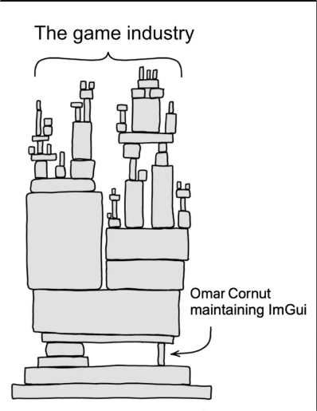

# IMGUI_Notes

Just a place I'm sharing all the notes and research I have on immediate mode user interfaces

## Casey Muratori

[Immediate-Mode Graphical User Interfaces - 2005](https://www.youtube.com/watch?v=Z1qyvQsjK5Y)  
[Original Molly Rocket IMGUI forum](https://web.archive.org/web/20140110175254/https://mollyrocket.com/forums/viewforum.php?f=10)  

## Sean Barret

The Inner Product column on Immediate Mode GUIs:  
[Game Developer - September 2005 (Page 34-36)](assets/GDM_September_2005.pdf)  
[Sample Implementation](https://silverspaceship.com/inner/imgui/)  

## Johannes Norneby

[Imgui Article](https://www.johno.se/book/imgui.html)  

* [PPT](https://johno.se/book/imgui.pdf)  s

[Trygve Reenskaug vs IMGUI](https://johno.se/book/trygve_vs_imgui.html)  

## Jonathan Blow

[Improving Our Immediate-Mode UI Stuff (Part 1)](https://youtu.be/gPKDnu5QaZk)  
[Improving Our Immediate-Mode UI Stuff (Part 2)](https://www.youtube.com/watch?v=upURrmzpD5Q)  

## Mr. 4th Programming (Allen Webster)

["Designing a UI System" with Ryan Fleury](https://www.youtube.com/watch?v=ueWE7qDbZ2w&pp=ygUMaW1ndWkgbXIgNHRo)

## nakst

[Writing a toy UI library](https://nakst.gitlab.io/tutorial/ui-part-1.html)  

## Nic Barker

[clay introduction (YT)](https://www.youtube.com/watch?v=DYWTw19_8r4)  
[How Clay's UI Layout Algorithm Works](https://www.youtube.com/watch?v=by9lQvpvMIc)  
[clay](https://github.com/nicbarker/clay)  

[Why Use C for UI Library? | Nic Barker](https://youtu.be/8ZlN07IvoPI)  

## Omar Cornut

[Dear Imgui](https://github.com/ocornut/imgui): The Industry Standard.  

[About the IMGUI paradigm](https://github.com/ocornut/imgui/wiki#about-the-imgui-paradigm)  

## Ryan Fleury

[UI Series -- Table of Contents](https://www.rfleury.com/p/ui-series-table-of-contents)  
[The RAD Debugger Project](https://github.com/EpicGames/raddebugger)  

* Specifically see the `ui` & `df_gfx` modules.

## Handmade

[Podcast Episode 3: Micha Mettke](https://handmade.network/podcast/ep/c1174949-adc4-492d-89b5-ca73dea4ff16)  
[January Meetup - Writing an IMGUI](https://youtu.be/wsJ8Y1HO250)  

* [PPT](https://www.slideshare.net/HenryRose9/implementing-imgui)  
* [vui](https://github.com/heroseh/vui)  

## Tscoding's Related Content

[Immediate UI for My Game in C++](https://youtu.be/8e56I1z9cn4)  
[Improving Immediate UI for My Game](https://youtu.be/-FYKw5rH2aU)  
[Making Reactive GUI From Scratch with Just Rectangles](https://youtu.be/-e_yyggsh_o)  

[imhui](https://github.com/tsoding/imhui)  
[OpenGL Text Rendering for My Immediate UI Library — Offline Stream #02](https://youtu.be/mq3UXqPmBE8)  
[We Need to Bring GUI Libraries Back! — Offline Stream #09](https://youtu.be/wWnjffo6gHc)  
[When UI Library is Bad — Offline Stream #13](https://youtu.be/yUGvLUPtgXY)  

## Other

[BoksOS Immediate-Mode GUI discussion with Allen Webster](https://www.youtube.com/watch?v=sAzgZjUJ7-M&pp=ygUTaW1ndWkgYWxsZW4gd2Vic3Rlcg%3D%3D)  
[DPI-aware IMGUI](https://web.archive.org/web/20220313014325/https://ourmachinery.com/post/dpi-aware-imgui/)  
[Imgui PPT](https://www.cse.chalmers.se/edu/year/2011/course/TDA361/Advanced%20Computer%20Graphics/IMGUI.pdf)  
[Jari Komppa's Article](https://solhsa.com/imgui/)  
[Unity Blog - Going deep with IMGUI and Editor customization](https://blog.unity.com/engine-platform/imgui-and-editor-customization)  
[Zero Memory Widget](https://perso.univ-lyon1.fr/thierry.excoffier/ZMW/)  

## Relevant Libraries

[boto-ui](https://github.com/talesm/boto-ui)  
[eui](https://github.com/erysdren/eui)  
[egui](https://github.com/emilk/egui)  
[Kiss SDL](https://github.com/actsl/kiss_sdl)  
[LiteGui](https://github.com/UnSkyToo/LiteGui)  
[microui](https://github.com/rxi/microui)  
[microui - Odin](https://github.com/odin-lang/Odin/tree/master/vendor/microui)  
[Nuklear](https://github.com/Immediate-Mode-UI/Nuklear)  
[PanGui](https://www.pangui.io)  
[Quarks](https://github.com/Immediate-Mode-UI/Quarks)  
[raygui](https://github.com/raysan5/raygui)  
[wtk](https://github.com/origamicomet/wtk)  
[zeroxer's IMGUI](https://github.com/zeroxer/IMGUI)  
[zgui](https://github.com/zxvnme/zgui)  

## Layout Related

[layout](https://github.com/randrew/layout)  
[CSS Flexible Box Layout](https://en.wikipedia.org/wiki/CSS_Flexible_Box_Layout)  
[CSS Grid Layout](https://en.wikipedia.org/wiki/CSS_grid_layout)  
